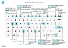

# Riferimento rapido per tasti di scelta rapida - Solo PC

#### Generale

|Premi questi tasti|Operazione da eseguire|  
|-|-|
|<kbd>Alt</kbd>|Mostra i tasti di accesso per navigare nella barra delle azioni o nel menu di navigazione|
|<kbd>Alt</kbd>+<kbd>F2</kbd>|Visualizzare e nascondere il riquadro Dettaglio informazioni|
|<kbd>Alt</kbd>+<kbd>N</kbd>|Creare un nuovo record|
|<kbd>Alt</kbd>+<kbd>MAIUSC</kbd>+<kbd>N</kbd>|Chiudere un record appena creato e creane uno nuovo|
|<kbd>Alt</kbd>+<kbd>O</kbd>|Aggiungere una nuova nota per il record selezionato|
|<kbd>Alt</kbd>+<kbd>D</kbd>|Aprire la funzionalità delle **informazioni**|
|<kbd>CTRL</kbd>+<kbd>Alt</kbd>+<kbd>Q</kbd>|Apri **Trova movimenti**|
|<kbd>Alt</kbd>+<kbd>Freccia SU</kbd>|Aprire la descrizione comando o l'errore di convalida|
|<kbd>Alt</kbd>+<kbd>Freccia GIÙ</kbd>|Aprire un menu a discesa o lookup|
|<kbd>Alt</kbd>+<kbd>T</kbd>|Aprire la pagina **Impostazioni personali**|
|<kbd>Alt</kbd>+<kbd>MAIUSC</kbd>+<kbd>W</kbd>|Aprire la scheda o il documento corrente in una nuova finestra|
|<kbd>CTRL</kbd>+<kbd>Ins</kbd>|Inserire una nuova riga in un documento|
|<kbd>CTRL</kbd>-<kbd>CANC</kbd>|Eliminare la riga in un documento, giornale o foglio di lavoro|
|<kbd>CTRL</kbd>+<kbd>MAIUSC</kbd>+<kbd>F12</kbd>|Ingrandire la parte Voci in una pagina del documento|
|<kbd>CTRL</kbd>+<kbd>F1</kbd>|Apri il riquadro della guida o un articolo della guida|
|<kbd>CTRL</kbd>+clic|Spostarsi durante la personalizzazione|
|<kbd>CTRL</kbd>+<kbd>O</kbd>|Passare a un'altra società o ambiente|
|<kbd>MAIUSC</kbd>+<kbd>F12</kbd>|Aprire Esplora ruoli, una panoramica delle funzionalità|
|<kbd>F5</kbd>/<kbd>CTRL</kbd>+<kbd>F5</kbd>|Aggiornare/ricaricare la pagina|
|<kbd>Tab</kbd>/<kbd>MAIUSC</kbd>+<kbd>Tab</kbd>|Spostare lo stato attivo sull'elemento successivo/precedente|
|<kbd>F6</kbd>/<kbd>MAIUSC</kbd>+<kbd>F6</kbd>|Spostare il cursore alla Scheda dettaglio/parte successiva.|

#### Spostarsi e selezionare righe

|Premi questi tasti|Operazione da eseguire|
|-|-|
|<kbd>Home/Fine|Passare al primo/ultimo campo|
|<kbd>CTRL</kbd>+<kbd>Home</kbd>/<kbd>Fine</kbd>|Passare alla prima/ultima riga|
|<kbd>CTRL</kbd>+<kbd>Freccia SU</kbd>/<kbd>Freccia GIÙ</kbd>|Spostarsi senza perdere la selezione|
|<kbd>CTRL</kbd>+<kbd>A</kbd>|Selezionare tutto|
|<kbd>CTRL</kbd>+<kbd>BARRA SPAZIATRICE</kbd>|Attivare/disattivare la selezione delle righe|
|<kbd>CTRL</kbd>/<kbd>MAIUSC</kbd>+clic|Aggiungere le righe alla selezione|
|<kbd>MAIUSC</kbd>+<kbd>Freccia SU</kbd>/<kbd>Freccia GIÙ</kbd>|Aggiungere la riga precedente/successiva alla selezione|
|<kbd>MAIUSC</kbd>+<kbd>PGSU</kbd>/<kbd>PGGIÙ</kbd>|Selezionare righe visibili sopra/sotto|
|<kbd>CTRL</kbd>+<kbd>INVIO</kbd>|Spostare lo stato attivo fuori dall'elenco|

#### Copiare e incollare

|Premi questi tasti|Operazione da eseguire|
|-|-|
|<kbd>CTRL</kbd>+<kbd>C</kbd>/<kbd>V</kbd>|Copiare/incollare righe|
|<kbd>F8</kbd>|Copiare il campo soprastante nella riga corrente|

#### Cercare, filtrare e ordinare

|Premi questi tasti|Operazione da eseguire|
|-|-|
|<kbd>Alt</kbd>+<kbd>F7</kbd>|Ordinare la colonna in ordine crescente/decrescente|
|<kbd>F3</kbd>|Attivare/disattivare la ricerca|
|<kbd>MAIUSC</kbd>+<kbd>F3</kbd>|Attivare/disattivare il riquadro Filtro	; spostare lo stato attivo sui filtri del campo|
|<kbd>Alt</kbd>+<kbd>F3</kbd>|Filtrare il valore della cella selezionata|
|<kbd>MAIUSC</kbd>+<kbd>Alt</kbd>+<kbd>F3</kbd>|Aggiungere un filtro sul campo selezionato|
|<kbd>CTRL</kbd>+<kbd>Alt</kbd>+<kbd>MAIUSC</kbd>+<kbd>F3</kbd>|Reimposta filtri|

#### Accesso rapido

|Premi questi tasti|Operazione da eseguire|
|-|-|
|<kbd>CTRL</kbd>+<kbd>MAIUSC</kbd>+<kbd>Invio</kbd>|Passare al campo Accesso rapido seguente al di fuori di un elenco|
|<kbd>INVIO</kbd>/<kbd>MAIUSC</kbd>+<kbd>INVIO</kbd>|Passare al campo Accesso rapido successivo/precedente|

##### Visualizzare in anteprima un report

|Premi questi tasti|Operazione da eseguire|
|-|-|
|<kbd>CTRL</kbd>+<kbd>Home</kbd>/<kbd>Fine</kbd>|Passare alla prima/ultima pagina|

#### Tastiera numerica

|Premi questi tasti|Operazione da eseguire|  
|-|-|
|<kbd>Alt</kbd>+<kbd>Separatore decimale</kbd>|Attivare/disattivare l'output del separatore decimale sulla tastierina numerica|

> [!TIP]
> Per una versione grafica facile da stampare, scegliere l'immagine seguente e scaricare il file PDF.
>
> 

[!INCLUDE[footer-include](includes/footer-banner.md)]
