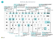

# Tasti di scelta rapida

In questo articolo viene fornita una panoramica di alcuni tasti di scelta rapida che è possibile utilizzare con [!INCLUDE[prod_short](includes/prod_short.md)].

Per una panoramica dei tasti di scelta rapida più utilizzati, vedere [Tasti di scelta rapida (solo PC)](keyboard-shortcuts-cheatsheet.md).

> [!TIP]
> Per una visualizzazione grafica dei tasti di scelta rapida più utilizzati, vedere l'immagine seguente e scaricare il file PDF.  
> 

## Sintesi

I tasti di scelta rapida agevolano l'accessibilità e rendono più semplice ed efficace la navigazione in differenti aree ed elementi in una pagina. Questi tasti di scelta rapida sono supportati dalla maggior parte dei Web browser, tuttavia, il comportamento potrebbe variare leggermente.

> [!NOTE]
> I tasti di scelta rapida qui descritti fanno riferimento al layout di tastiera statunitense. Il layout dei tasti su altri tipi di tastiere può non corrispondere esattamente alla disposizione dei tasti su una tastiera statunitense.

Molti dei tasti di scelta rapida sono uguali indipendentemente dal sistema operativo utilizzato (Windows o macOS). Tuttavia, alcuni sono differenti per macOS. Questi tasti di scelta rapida sono indicati tra parentesi nelle sezioni seguenti.

> [!NOTE]
> Business Central supporta solo un unico set di caratteri per i dati. Alcuni caratteri, pertanto, potrebbero non essere supportati nell'ambiente ed è possibile che si verifichino problemi durante il recupero di dati immessi utilizzando un set di caratteri diverso. Ciò può applicarsi anche ai tasti di scelta rapida. È possibile, ad esempio, che l'ambiente supporti solo caratteri inglesi e russi. In questo caso, se immetti i dati in una lingua diversa potrebbero non essere archiviati correttamente. Per verificare di avere individuato correttamente le lingue supportate da Business Central, rivolgersi all'amministratore di sistema. 

> [!NOTE]
> Oltre alle scelte rapide da tastiera globali descritte in questo articolo, sono disponibili una serie di scelte rapide specifiche per l'azienda. Ad esempio, nella versione generica di [!INCLUDE[prod_short](includes/prod_short.md)], <kbd>F9</kbd> registra un documento e <kbd>CTRL</kbd>+<kbd>F7</kbd> mostra i movimenti contabili per un record quando si apre il record in una scheda. Questo articolo include alcune delle scelte rapide più comuni specifiche per l'azienda, che sono mostrate in corsivo. Tieni presente che le scelte rapide effettive potrebbero essere diverse nella tua soluzione. Nell'interfaccia utente, la scelta rapida da tastiera è mostrata nella descrizione comando per l'azione in questione.

## Tasti di scelta rapida generali

La tabella seguente descrive i tasti di scelta rapida per la navigazione e l'accesso a diversi elementi di una pagina. Gli elementi includono azioni, elenchi a discesa, ricerche e altro. Per informazioni dettagliate sui tasti di scelta rapida per la navigazione nei record dopo l'accesso a un elenco, vedere la sezione successiva.

|Premi questi tasti (in macOS)|Operazione da eseguire|
|--------------------------------|----------|
|<kbd>Alt</kbd>|Mostra i tasti di accesso per la selezione delle azioni nella barra delle azioni e nel menu di navigazione della pagina. Per ulteriori informazioni, vedi [Tasti di accesso](#access-keys-for-action-bar-and-navigation-menu).|
|<kbd>Alt</kbd>+<kbd>Freccia GIÙ</kbd>|Aprire un elenco a discesa o cercare un valore per un campo.|
|<kbd>CTRL</kbd>+<kbd>OPZIONE</kbd>+<kbd>Freccia GIÙ</kbd>|Apri la scheda di un record correlato o una pagina elenco filtrata in base al valore nel campo di ricerca o modifica assistita.|
|<kbd>Alt</kbd>+<kbd>FRECCIA SU</kbd>|Mostra la descrizione comando per un campo o un'intestazione di colonna di una tabella. Se il campo include errori di convalida, premi <kbd>Alt</kbd>+<kbd>Freccia SU</kbd> per visualizzare l'errore di convalida. Premi <kbd>Esc</kbd> o <kbd>Alt</kbd>+<kbd>Freccia SU</kbd> per chiudere la descrizione comando.|
|<kbd>F2</kbd>|Passare dalla selezione dell'intero valore di campo al posizionamento del cursore alla fine del valore di campo.|
|<kbd>Alt</kbd>+<kbd>F2</kbd>|Visualizzare e nascondere il riquadro Dettaglio informazioni|
|<kbd>Alt</kbd>+<kbd>MAIUSC</kbd>+<kbd>F2</kbd>|<kbd>Spostarsi</kbd> tra **Dettagli** e **Allegati** nel riquadro Dettaglio informazioni.|
|<kbd>Alt</kbd>+<kbd>O</kbd>|Aggiungere una nuova nota per il record selezionato, anche se il riquadro Dettaglio informazioni non è aperto.|
|<kbd>Alt</kbd>+<kbd>D</kbd>  (<kbd>CTRL</kbd>+<kbd>Opzione</kbd>+<kbd>Q</kbd>)|Aprire la finestra della **funzionalità delle informazioni**. Per ulteriori informazioni, vedi [Individuare pagine e informazioni con la funzionalità delle informazioni](ui-search.md).|
|<kbd>CTRL</kbd>+<kbd>Alt</kbd>+<kbd>Q</kbd>  (<kbd>CTRL</kbd>+<kbd>Opzione</kbd>+<kbd>Cmd</kbd>+<kbd>Q</kbd>)|Apri la pagina **Trova voci** per trovare documenti e voci correlati tra loro in base a informazioni comuni, come il numero del documento o la data di registrazione. Per ulteriori informazioni, vedi [Trovare voci correlate per i documenti pubblicati ](ui-find-entries.md)|
|<kbd>Alt</kbd>+<kbd>N</kbd> |Aprire una pagina per creare un nuovo record (equivale a scegliere le azioni **Nuovo** e **+**).|
|<kbd>Alt</kbd>+<kbd>MAIUSC</kbd>+<kbd>N</kbd> |Chiudere una pagina appena creata e aprirne una nuova per creare un nuovo record. In modo analogo, <kbd>Alt</kbd>+<kbd>F9</kbd> registra un documento e ne crea uno nuovo.|
|<kbd>Alt</kbd>+<kbd>T</kbd>|Aprire la pagina **Impostazioni personali**.|
|<kbd>Alt</kbd>+<kbd>freccia DESTRA</kbd>|Cercare informazioni aggiuntive o valori sottostanti per un campo che contiene il pulsante  . Utilizzato quando il pulsante a discesa usuale (<kbd>Alt</kbd>+<kbd>Freccia GIÙ</kbd>) nello stesso campo viene utilizzato per un altro scopo.|
|<kbd>CTRL</kbd>+<kbd>Alt</kbd>+<kbd>MAIUSC</kbd>+<kbd>C</kbd>|Visualizzare informazioni nel badge società. Questo collegamento non è più supportato a partire dal secondo ciclo di rilascio di Business Central 2022 (versione 21) e sostituito da <kbd>CTRL</kbd>+<kbd>O</kbd>. |
|<kbd>CTRL</kbd>+<kbd>Alt</kbd>+<kbd>F1</kbd>|Aprire e chiudere il riquadro Controllo pagina. Il riquadro Controllo pagina mostra informazioni sulla pagina, come la relativa tabella di origine, campi, filtri, estensioni e altro.  Per ulteriori informazioni, vedere [Controllo di pagine](across-inspect-page.md).|
|<kbd>CTRL</kbd>+<kbd>C</kbd> |Copiare il valore del campo. Se lo stato attivo è sul campo e il testo non si è selezionato nel campo, viene copiato l'intero valore. Se hai selezionato del testo nel campo, viene copiato solo il testo selezionato.|
|<kbd>CTRL</kbd>+<kbd>F1</kbd>|Apri il [riquadro della guida](product-help-and-support.md#help-pane) o un articolo della guida di Business Central su [Microsoft Learn](/dynamics365/business-central/), a seconda della versione di Business Central.|
|<kbd>CTRL</kbd>+<kbd>F12</kbd>|Passare dalla visualizzazione a layout ampio a quella a layout stretto e viceversa.|
|<kbd>CTRL</kbd>+seleziona|Navigare durante la personalizzazione quando l'azione è evidenziata con una freccia. Per ulteriori informazioni, vedere [Personalizzare l'area di lavoro](ui-personalization-user.md).|  
|<kbd>CTRL</kbd>+<kbd>F5</kbd>|Ricaricare l'applicazione [!INCLUDE[prod_short](includes/prod_short.md)] (equivale ad aggiornare/ricaricare nel browser).|
|<kbd>F5</kbd>|Aggiornare i dati nella pagina corrente.  Utilizzare questo tasto per garantire che i dati nella pagina siano aggiornati con le modifiche apportate da altri utenti mentre si sta lavorando.|
|<kbd>CTRL</kbd>+<kbd>O</kbd>|Apri il riquadro **Società disponibili** per passare a un'altra società o ambiente. Per ulteriori informazioni, vedere [Passare a un'altra società o ambiente](ui-organization-switch.md).|
|<kbd>Immettere</kbd>|Abilitare l'elemento o il comando con lo stato attivo o accedervi.|
|<kbd>ESC</kbd>|Chiudere la pagina corrente o l'elenco a discesa.|
|<kbd>TAB</kbd>|Spostare lo stato attivo sul controllo o sull'elemento successivo in una pagina, ad esempio azioni, pulsanti, campi o intestazioni di elenchi.|
|<kbd>MAIUSC</kbd>+<kbd>Tab</kbd>|Spostare lo stato attivo sul controllo o sull'elemento precedente in una pagina, ad esempio azioni, pulsanti, campi o intestazioni di elenchi.|
|<kbd>S</kbd> e <kbd>N</kbd>|Attivare i pulsanti **Sì** e **No** nelle finestre di dialogo. I tasti effettivi variano in base alla lingua corrente specificata in **Impostazioni personali**. Ad esempio, premi <kbd>J</kbd> per attivare il pulsante **Ja** quando si utilizza la lingua tedesca.|

## Tasti di scelta rapida negli elenchi

Nella tabella seguente sono descritti i tasti di scelta rapida che è possibile utilizzare in una pagina elenco. L'azione di scelta rapida è leggermente diversa a seconda se la pagina viene visualizzata nella visualizzazione elenco o nella visualizzazione riquadri.
<!--
> [!Note]
> In the table that follows, the term *actionable field* refers to a field on which you can do something, like change a value or link to another page. In general, the shortcuts will skip over fields that display information that you cannot change from the list (in other words, fields that are read-only).
-->
### Generale

|Premi questi tasti (in macOS)|Per effettuare questa operazione in una visualizzazione elenco|Per effettuare questa operazione in una visualizzazione riquadri |
|--------------------------------|-------------------------|--------------------------|
|<kbd>Alt</kbd>+<kbd>F7</kbd> |Ordinare la colonna selezionata in ordine crescente o decrescente.|Non applicabile.|
|<kbd>Alt</kbd>+<kbd>N</kbd>|Inserire una nuova riga in un elenco modificabile, ad esempio la pagina **Budget C/G**.|Stessa operazione.|
|<kbd>MAIUSC</kbd>+<kbd>F9</kbd>|Registra e stampa un documento.|Stessa operazione.|
|<kbd>MAIUSC</kbd>+<kbd>F10</kbd> |Aprire un menu di opzioni disponibili per la riga selezionata.|Stessa operazione.|
|<kbd>Alt</kbd>+<kbd>D</kbd>|Apri le voci del set di dimensioni.|Stessa operazione.|
|<kbd>CTRL</kbd>+<kbd>F7</kbd>|Apri voci contabili, voci di registro, voci di costo e così via.|
|<kbd>CTRL</kbd>+<kbd>F9</kbd>|Rilascia il documento.|Stessa operazione.|
|<kbd>F7</kbd>|Apri le statistiche.|Stessa operazione.|
|<kbd>F9</kbd>|Invia, emetti, registra o inverti il documento.|Stessa operazione.|
|<kbd>MAIUSC</kbd>+<kbd>CTRL</kbd>+<kbd>F</kbd>|Invia le righe suggerite nella pagina **Prospetto flusso di cassa**|Non applicabile.|
|<kbd>MAIUSC</kbd>+<kbd>CTRL</kbd>+<kbd>I</kbd>|Visualizza i numeri di serie e di lotto assegnati alla voce nel documento o nel giornale di registrazione.|Non applicabile.|

### Spostarsi tra le righe e le colonne

Griglie contenenti righe e colonne esistono in molti tipi di pagina in [!INCLUDE[prod_short](includes/prod_short.md)], ad esempio pagine di elenco e parti **Righe** sui documenti. Lo spostamento da una cella all'altra attraverso una griglia è completamente abilitato per la tastiera.

| Premi questi tasti (in macOS) | Per effettuare questa operazione in una visualizzazione elenco | Per effettuare questa operazione in una visualizzazione riquadri |
|--|--|--|
| <kbd>CTRL</kbd>+<kbd>Home</kbd>  (<kbd>Fn</kbd>+<kbd>CTRL</kbd>+<kbd>Freccia SINISTRA</kbd>) | Selezionare la prima riga nell'elenco; lo stato attivo rimane nella stessa colonna. | Spostare il cursore sul primo riquadro nella prima riga. |
| <kbd>CTRL</kbd>+<kbd>Fine</kbd>  (<kbd>Fn</kbd>+<kbd>CTRL</kbd>+<kbd>Freccia DESTRA</kbd>) | Selezionare l'ultima riga nell'elenco; lo stato attivo rimane nella stessa colonna. | Spostare il cursore sull'ultimo riquadro nell'ultima riga. |
| <kbd>Home page</kbd>  (<kbd>Fn</kbd>+<kbd>Freccia SINISTRA</kbd>) | Spostare il cursore sul primo campo nella riga. | Spostare il cursore sul primo riquadro nella riga. |
| <kbd>FINE</kbd>  (<kbd>Fn</kbd>+<kbd>Freccia DESTRA</kbd>) | Spostare il cursore sull'ultimo campo nella riga. | Spostare il cursore sull'ultimo riquadro nella riga. |
| <kbd>Immettere</kbd> | Aprire il record associato al campo.  Applicabile solo se una pagina schede è associata al record. | Apre il record.  Applicabile solo se una pagina schede è associata al record. |
| <kbd>CTRL</kbd>+<kbd>INVIO</kbd> | Spostare lo stato attivo all'elemento successivo al di fuori dell'elenco. | Spostare lo stato attivo all'elemento successivo al di fuori dell'elenco. |
| <kbd>Pagina su</kbd>  (<kbd>Fn</kbd>+<kbd>Freccia SU</kbd>) | Scorrere per visualizzare il set di righe sopra le righe correnti nella visualizzazione. | Scorre per visualizzare i riquadri del set sopra i riquadri correnti nella visualizzazione. |
| <kbd>Pagina giù</kbd>  (<kbd>Fn</kbd>+<kbd>Freccia GIÙ</kbd>) | Scorrere per visualizzare il set di righe sotto le righe correnti nella visualizzazione. | Scorrere per visualizzare il set di riquadri sotto i riquadri correnti nella visualizzazione. |
| <kbd>Freccia GIÙ</kbd> | Spostare il cursore nella stessa colonna sul campo nella riga sotto. | Spostare il cursore nella stessa colonna sul riquadro nella riga sotto. |
| <kbd>Freccia su</kbd> | Spostare il cursore nella stessa colonna sul campo nella riga sopra. | Spostare il cursore nella stessa colonna sul riquadro nella riga sopra. |
| <kbd>Freccia destra</kbd> | In un elenco di sola visualizzazione, spostare il cursore nella stessa riga sul campo successivo a destra.  In un elenco modificabile, spostarsi a destra all'interno del campo corrente. | Spostare il cursore nella stessa riga sul riquadro successivo a destra. |
| <kbd>Freccia sinistra</kbd> | In un elenco di sola visualizzazione, spostare il cursore nella stessa riga sul campo precedente a sinistra.   In un elenco modificabile, spostarsi a sinistra all'interno del campo corrente. | Spostare il cursore nella stessa riga sul riquadro precedente a sinistra. |
| <kbd>TAB</kbd> | In un elenco modificabile, spostare il cursore nella stessa riga sul campo successivo a destra. | Non applicabile. | 
| <kbd>MAIUSC</kbd>+<kbd>Tab</kbd> | In un elenco modificabile, spostare il cursore nella stessa riga sul campo precedente a sinistra. | Non applicabile. |

### Seleziona, Copia e Incolla

|Premi questi tasti (in macOS)|Per effettuare questa operazione in una visualizzazione elenco |Per effettuare questa operazione in una visualizzazione riquadri |
|--------------------------------|--------------------------|--------------------------|
|<kbd>CTRL</kbd>+seleziona  (<kbd>CMD</kbd>+seleziona)|Estendere la selezione delle righe per includere la riga che viene selezionata.|Non applicabile.|
|<kbd>MAIUSC</kbd>+seleziona|Estendere la selezione delle righe per includere la riga che viene selezionata e tutte le righe precedenti.  È possibile utilizzare questa scelta rapida dopo avere usato <kbd>CTRL</kbd>+<kbd>freccia SU</kbd> o <kbd>CTRL</kbd>+<kbd>freccia GIÙ</kbd> per estendere la selezione.|Non applicabile.|
|<kbd>CTRL</kbd>+<kbd>Freccia SU</kbd>  (<kbd>CTRL</kbd>+<kbd>Cmd</kbd>+<kbd>Freccia SU</kbd>)|Spostare lo stato attivo sulla riga sopra e mantenere la riga corrente selezionata.|Non applicabile.|
|<kbd>CTRL</kbd>+<kbd>Freccia GIÙ</kbd>  (<kbd>CTRL</kbd>+<kbd>Cmd</kbd>+<kbd>Freccia GIÙ</kbd>)|Spostare lo stato attivo sulla riga sotto e mantenere la riga corrente selezionata.|Non applicabile.|
|<kbd>CTRL</kbd>+<kbd>BARRA SPAZIATRICE</kbd>  (<kbd>CTRL</kbd>+<kbd>Cmd</kbd>+BARRA SPAZIATRICE)|Estendere la selezione delle righe per includere la riga attiva.  È possibile utilizzare questa scelta rapida dopo avere usato <kbd>CTRL</kbd>+<kbd>freccia SU</kbd> o <kbd>CTRL</kbd>+<kbd>Freccia GIÙ</kbd> per estendere la selezione.|Non applicabile.|
|<kbd>CTRL</kbd>+<kbd>A</kbd>|Selezionare tutte le righe.|Non applicabile.|
|<kbd>CTRL</kbd>+<kbd>C</kbd>  (<kbd>Cmd</kbd>+<kbd>C</kbd>)|Copiare le righe selezionate negli Appunti.|Sì, ma solo per una singolo riquadro selezionato.|
|<kbd>CTRL</kbd>+<kbd>V</kbd>  (<kbd>Cmd</kbd>+<kbd>V</kbd>)|Incolla le righe selezionate dagli Appunti nella pagina corrente o in un documento esterno, come Microsoft Excel o Outlook. Questo è possibile solo in elenchi modificabili.|Non applicabile.|
|<kbd>MAIUSC</kbd>+<kbd>Freccia SU</kbd>|Estendere la selezione delle righe per includere la riga sopra.|Non applicabile.|
|<kbd>MAIUSC</kbd>+<kbd>Freccia GIÙ</kbd>|Estendere la selezione delle righe per includere la riga sotto.|Non applicabile.|
|<kbd>MAIUSC</kbd>+<kbd>PGSU</kbd>  (<kbd>MAIUSC</kbd>+<kbd>Fn</kbd>+<kbd>Freccia SU</kbd>)|Estendere la selezione per includere tutte le righe visibili sopra la selezione di righe corrente.|Non applicabile.|
|<kbd>MAIUSC</kbd>+<kbd>PGGIÙ</kbd>  (<kbd>MAIUSC</kbd>+<kbd>Fn</kbd>+<kbd>Freccia GIÙ</kbd>)|Estendere la selezione per includere tutte le righe visibili sotto la selezione di righe corrente.|Non applicabile.|
|<kbd>F8</kbd>|Copiare il campo nella stessa colonna della riga precedente e lo incolla nella riga corrente. Questo è possibile solo in elenchi modificabili. L'utilizzo di questo tasto seguito dal tasto <kbd>Tab</kbd> consente di compilare rapidamente i campi delle voci per cui si desidera avere lo stesso valore della riga precedente.|Non applicabile.|

### Cercare e filtrare elenchi

|Premi questi tasti (in macOS)|Operazione da eseguire|
|--------------------------------|----------|
|<kbd>F3</kbd>|Attiva/disattiva la casella di ricerca.<ul><li>Attivare la casella di ricerca, di modo che sia possibile iniziare a digitare il testo di ricerca.</li><li>Se la casella di ricerca è già attivata, <kbd>F3</kbd> torna all'elenco senza cancellare il testo di ricerca.</li><ul>|
|<kbd>MAIUSC</kbd>+<kbd>F3</kbd>|Aprire e chiudere il riquadro dei filtri.<ul><li> Se il riquadro filtri non è aperto, <kbd>MAIUSC</kbd>+<kbd>F3</kbd> lo apre e viene evidenziata l'azione **+ Filtro** sotto **Filtra elenco per**. È possibile quindi premi <kbd>Enter</kbd> per iniziare ad aggiungere un filtro di campo.</li><li>Se il riquadro filtri è già aperto, <kbd>MAIUSC</kbd>+<kbd>F3</kbd> lo chiude ma non cancella i filtri aggiunti.</li></ul>|
|<kbd>CTRL</kbd>+<kbd>MAIUSC</kbd>+<kbd>F3</kbd>|Aprire e chiudere il riquadro dei filtri.<ul><li> Se il riquadro filtri non è aperto, <kbd>CTRL</kbd>+<kbd>MAIUSC</kbd>+<kbd>F3</kbd> lo apre e viene evidenziata l'azione **+ Filtro** sotto **Filtra totale per**. Quindi puoi premere <kbd>Invio</kbd> per iniziare ad aggiungere un filtro dei totali.</li><li>Se il riquadro filtri è già aperto, <kbd>CTRL</kbd>+<kbd>MAIUSC</kbd>+<kbd>F3</kbd> lo chiude ma non cancella i filtri aggiunti.</li></ul>  |
|<kbd>Alt</kbd>+<kbd>F3</kbd>|Attivare/disattivare i filtri per il valore selezionato.<ul><li>Applica un filtro di colonna sul valore del campo selezionato nell'elenco. Questo equivale a scegliere **Filtra in base a questo valore** da un'intestazione di colonna. Apre il riquadro dei filtri, imposta il filtro sul valore selezionato, mentre lo stato attivo rimane sulla cella dell'elenco.</li><li>Se la colonna è già filtrata, <kbd>Alt</kbd>+<kbd>F3</kbd> cancella il filtro su quella colonna.</li></ul> |
|<kbd>MAIUSC</kbd>+<kbd>Alt</kbd>+<kbd>F3</kbd>|Aprire il riquadro dei filtri e aggiungere un filtro alla colonna selezionata nell'elenco. Lo stato attivo si trova sul nuovo campo filtro che consente di iniziare subito a digitare i criteri del filtro.   Questo equivale a selezionare **Filtro** dall'intestazione della colonna.  Se esiste già un filtro sul campo, viene aggiunto un nuovo filtro. |
|<kbd>CTRL</kbd>+<kbd>MAIUSC</kbd>+<kbd>ALT</kbd>+<kbd>F3</kbd>|Reimpostare i filtri. Ciò equivale a scegliere **Reimposta filtri** nel riquadro dei filtri e si applica ai filtri di campi e totali.   I filtri tornano ai filtri predefiniti per la vista corrente. Se la visualizzazione corrente è **Tutto**, equivale a tornare a una visualizzazione non filtrata con tutti i record. |
|<kbd>CTRL</kbd>+<kbd>INVIO</kbd>|Spostare di nuovo lo stato attivo dal riquadro filtri all'elenco.|

## Tasti di scelta rapida in schede e documenti

I tasti di scelta rapida sono disponibili nelle pagine scheda (come **Scheda cliente**) e nelle pagine documento (come **Ordine vendita**) per visualizzare e modificare i record.

|Premi questi tasti (in macOS)|Operazione da eseguire|
|--------------------------------|----------|
|<kbd>Alt</kbd>+<kbd>D</kbd>|Apri le voci del set di dimensioni.|
|<kbd>Alt</kbd>+<kbd>F6</kbd>|Attiva/disattiva la compressione/espansione per la Schedadettaglio o parte (pagina secondaria) corrente.|
|<kbd>Alt</kbd>+<kbd>F9</kbd>|Crea un nuovo documento e registralo.|
|<kbd>Alt</kbd>+<kbd>G</kbd>|Aprire la pagina **Trova movimenti** per la ricerca di movimenti relativi al documento registrato. Funziona anche sugli elenchi.|
|<kbd>Alt</kbd>+<kbd>N</kbd> |Aprire una pagina per creare un nuovo record; equivale a selezionare l'azione **Nuovo**. |
|<kbd>Alt</kbd>+<kbd>MAIUSC</kbd>+<kbd>N</kbd> |Chiudere una pagina e aprirne una nuova per creare un nuovo record; equivale a selezionare l'azione **OK e nuovo**. |
|<kbd>Alt</kbd>+<kbd>MAIUSC</kbd>+<kbd>W</kbd> |Aprire la scheda o il documento corrente in una nuova finestra. Per ulteriori informazioni, vedere [Multitasking in più pagine ](ui-enter-data.md#multitasking-across-multiple-pages).|
|<kbd>CTRL</kbd>+<kbd>INVIO</kbd>|Salvare e chiudere la pagina.|
|<kbd>CTRL</kbd>+<kbd>Freccia GIÙ</kbd>|Aprire il record successivo per un'entità.|
|<kbd>CTRL</kbd>+<kbd>Freccia SU</kbd> |Aprire il record precedente per un'entità.|
|<kbd>CTRL</kbd>+<kbd>Ins</kbd> |Inserire una nuova riga in documenti.|
|<kbd>CTRL</kbd>+<kbd>CANC</kbd> |Eliminare la riga in documenti, giornali e fogli di lavoro.|
|<kbd>CTRL</kbd>+<kbd>F7</kbd>|Apri voci contabili, voci di registro, voci di costo e così via.|
|<kbd>CTRL</kbd>+<kbd>F9</kbd>|Rilascia il documento.|
|<kbd>CTRL</kbd>+<kbd>MAIUSC</kbd>+<kbd>F12</kbd> |Ingrandire la parte Voci in una pagina del documento. Premi di nuovo i tasti per tornare alla visualizzazione normale. Per ulteriori informazioni, vedere [Spostare lo stato attivo su Voci](ui-enter-data.md#Focus).|
|<kbd>F6</kbd>|Spostare il cursore alla Scheda dettaglio o alla parte successiva (pagina secondaria).|
|<kbd>F7</kbd>|Apri le statistiche.|
|<kbd>F9</kbd>|Invia, emetti, registra o inverti il documento.|
|<kbd>MAIUSC</kbd>+<kbd>CTRL</kbd>+<kbd>F9</kbd>|Invia, stampa e conserva la ricevuta di magazzino.|
|<kbd>MAIUSC</kbd>+<kbd>F6</kbd>|Spostarsi sulla parte o Schedadettaglio precedente (pagina secondaria).|
|<kbd>MAIUSC</kbd>+<kbd>F9</kbd>|Registra e stampa un documento.|
|<kbd>MAIUSC</kbd>+<kbd>F11</kbd>|Applica i movimenti, ottiene i documenti di origine o ottiene i documenti warehouse.|

## Scelte rapide di Immissione rapida per campi

I tasti di scelta rapida seguenti sono relativi alla funzionalità Accesso rapido in carte, documenti e pagine elenco. Negli elenchi, i tasti di scelta rapida non possono essere utilizzati quando l'elenco è nella visualizzazione riquadri. Per ulteriori informazioni su Accesso rapido, vedere [Accelerare l'immissione di dati utilizzando Accesso rapido](ui-enter-data.md#QuickEntry).

|Premi questi tasti (in macOS)|Operazione da eseguire|Osservazioni|
|--------------------------------|----------|-------|
|<kbd>Immettere</kbd>|Confermare il valore nel campo corrente e passare al campo Accesso rapido successivo.||
|<kbd>MAIUSC</kbd>+<kbd>INVIO</kbd>|Confermare il valore nel campo corrente e passare al campo Accesso rapido precedente.||
|<kbd>CTRL</kbd>+<kbd>MAIUSC</kbd>+<kbd>Invio</kbd>|Confermare il valore nella colonna corrente e passare al campo Accesso rapido successivo al di fuori dell'elenco.  Questa combinazione di tasti di scelta rapida si applica agli elenchi incorporati in una pagina, ad esempio voci in un ordine di vendita. Consente di uscire rapidamente dall'elenco e di continuare a immettere dati in altri campi nella pagina.|

## Tasti di scelta rapida nel calendario (selezione data)

Quando si imposta un campo data, è possibile inserire la data manualmente o aprire un calendario (selezione data) che consente di selezionare la data desiderata. Nella tabella seguente sono descritti i tasti di scelta rapida nel calendario.

|Premi questi tasti (in macOS)|Operazione da eseguire|
|--------------------------------|----------|
|<kbd>CTRL</kbd>+<kbd>Home</kbd>|Aprire il calendario se chiuso. **Nota**: non funziona se il campo della data si trova in una griglia, in cui <kbd>CTRL</kbd>+<kbd>Home</kbd> passa alla prima riga.|
|<kbd>CTRL</kbd>+<kbd>Home</kbd>  (<kbd>Cmd</kbd>+<kbd>Home</kbd>)|Spostare il cursore al mese corrente, al giorno corrente.|
|<kbd>Freccia sinistra</kbd>  (<kbd>Freccia SINISTRA</kbd>)|Sposta il cursore al giorno precedente.|
|<kbd>Freccia destra</kbd>  (<kbd>Freccia DESTRA</kbd>)|Spostare il cursore al giorno successivo.|
|<kbd>Freccia su</kbd>  (<kbd>Freccia SU</kbd>)|Spostare il cursore alla settimana precedente, lo stesso giorno della settimana.|
|<kbd>Freccia GIÙ</kbd>  (<kbd>Freccia GIÙ</kbd>)|Spostare il cursore alla settimana successiva, lo stesso giorno della settimana.|
|<kbd>Immettere</kbd>|Selezionare la data attiva.|
|<kbd>CTRL</kbd>+<kbd>Fine</kbd>  (<kbd>Cmd</kbd>+<kbd>Fine</kbd>)|Chiudere il calendario ed eliminare la data corrente.|
|<kbd>ESC</kbd>|Chiudere il calendario senza una selezione, mantenere la data corrente.|
|<kbd>Pagina giù</kbd>|Spostare il cursore al mese successivo.|
|<kbd>Pagina su</kbd>|Spostare il cursore al mese precedente.|  

## Tasti di scelta rapida nei campi Data

|Premi questi tasti (in macOS)|Operazione da eseguire|
|--------------------------------|----------|
|<kbd>o</kbd>|Immettere la data corrente. "T" sta per "oggi".|
|<kbd>w</kbd>|Immettere la data del lavoro. Per ulteriori informazioni, vedere [Data del lavoro](ui-change-basic-settings.md#work-date).|

## Tasti di scelta rapida nell'anteprima report

|Premi questi tasti (in macOS)|Operazione da eseguire|
|--------------------------------|----------|
|<kbd>Freccia GIÙ</kbd>|Scorrere la pagina verso il basso.|  
|<kbd>Freccia su</kbd>|Scorrere la pagina verso l'alto.|
|<kbd>CTRL</kbd>+<kbd>0</kbd> (zero)  (<kbd>Cmd</kbd>+<kbd>0</kbd>)|Adattare l'intera pagina alla finestra. |
|<kbd>CTRL</kbd>+<kbd>Home</kbd>  (<kbd>Cmd</kbd>+<kbd>Home</kbd>)|Passare alla prima pagina del report.|
|<kbd>CTRL</kbd>+<kbd>Fine</kbd>  (<kbd>Cmd</kbd>+<kbd>Fine</kbd>)|Passare all'ultima pagina del report.|
|<kbd><kbd>Freccia sinistra</kbd></kbd>|Scorrere la pagina verso sinistra quando è ingrandita e non è quindi interamente visibile. |
|<kbd>Freccia destra</kbd>|Scorrere la pagina verso destra quando è ingrandita e non è quindi interamente visibile. |
|<kbd>Pagina giù</kbd>  (<kbd>Fn</kbd>+<kbd>Freccia GIÙ</kbd>)|Passare alla pagina successiva del report.|
|<kbd>Pagina su</kbd>  (<kbd>Fn</kbd>+<kbd>Freccia SU</kbd>)|Passare alla pagina precedente del report.|

## Tasti di scelta rapida per ingrandire e ridurre

|Premi questi tasti|Operazione da eseguire|
|--------------------------------|----------|
|<kbd>CTRL</kbd>+<kbd>+</kbd>|Ingrandire la pagina corrente.|  
|<kbd>CTRL</kbd>+<kbd>-</kbd>|Ridurre la pagina corrente.|  
|<kbd>CTRL</kbd>+<kbd>0</kbd>|Ingrandire o ridurre del 100% la pagina corrente.|  

## Tasti di scelta rapida per Esplora ruoli

Esplora ruoli offre una panoramica e l'accesso rapido a tutte le funzionalità aziendali disponibili per un specifico ruolo. Per ulteriori informazioni, vedere [Ricerca di pagine con Esplora ruoli](ui-role-explorer.md).

|Premi questi tasti (in macOS)|Operazione da eseguire|
|--------------------------------|----------|
|<kbd>MAIUSC</kbd>+<kbd>F12</kbd>|Aprire Esplora ruoli.|
|<kbd>F3</kbd>|Aprire la casella **Trova** in Esplora ruoli per trovare funzioni in base a una parola o un termine di ricerca specifico.|
|<kbd>MAIUSC</kbd> <kbd>F3</kbd> o <kbd>CTRL</kbd>+<kbd>Freccia GIÙ</kbd>|Spostare lo stato attivo sulla successiva funzionalità trovata in Esplora ruoli. <kbd>F3</kbd> sposterà lo stato attivo sulla casella **Trova** dopo l'ultima funzionalità trovata.|
|<kbd>MAIUSC</kbd> <kbd>F3</kbd> or <kbd>CTRL</kbd>+<kbd>Freccia SU</kbd>|Spostare lo stato attivo sulla precedente funzionalità trovata in Esplora ruoli.|
|<kbd>CTRL</kbd>+<kbd>MAIUSC</kbd>|Espandere o comprimere tutti i nodi secondari, oltre ai nodi di livello principale, quando si sceglie l'azione **Espandi** o **Comprimi**.|

## Tasti di scelta rapida della tastierna numerica

Nella tabella seguente sono descritti i tasti di scelta rapida della tastierina numerica.

|Premi questi tasti (in macOS)|Operazione da eseguire|
|--------------------------------|----------|
|<kbd>Alt</kbd>+<kbd>Separatore decimale</kbd>|Cambia l'output del tasto separatore decimale sul punto (.) o sul carattere determinato dall'impostazione **Area geografica** della pagina **Impostazioni personali**. Per ulteriori informazioni, vedi [Impostazione del separatore decimale usato dalle tastiere numeriche](ui-enter-data.md#decimal).|

## Tasti di accesso per la barra delle azioni e il menu di navigazione

I tasti di accesso sono scorciatoie da tastiera che consentono di selezionare azioni specifiche nella barra delle azioni e nel menu di navigazione. Ti consente di passare da un'azione all'altra per accedere alla pagina desiderata. I tasti di accesso sono disponibili nel client Web di Business Central e sono simili ai tasti di accesso in Excel e Word Online.  

Per utilizzare i tasti di accesso su una pagina, seleziona prima il tasto <kbd>Alt</kbd> per visualizzare *suggerimenti per i tasti*, che sono lettere in piccole caselle accanto alle azioni nella barra delle azioni e nel menu di navigazione. 

 

Per selezionare un'azione, seleziona la combinazione di tasti visualizzata nella descrizione dei tasti, ad esempio <kbd>H</kbd> o <kbd>J</kbd>+<kbd>F</kbd>.
- Se l'azione si apre in un sottomenu di altre azioni, vengono mostrati i suggerimenti dei tasti per il sottomenu, consentendoti di continuare a utilizzare i tasti di accesso se lo desideri.
- Se l'azione apre una pagina diversa, i suggerimenti dei tasti sono disattivati. Per mostrarli di nuovo, seleziona il tasto <kbd>Alt</kbd>. 
 
## Vedere anche

[Riferimento rapido per tasti di scelta rapida - Solo PC](keyboard-shortcuts-cheatsheet.md)  
[Funzionalità di accessibilità](ui-accessibility.md)  
[Prepararsi a fare affari](ui-get-ready-business.md)  
[Usare [!INCLUDE[prod_short](includes/prod_short.md)]](ui-work-product.md)  
[Domande frequenti](across-faq.yml)  
[Trova movimenti](ui-find-entries.md)  

[!INCLUDE[footer-include](includes/footer-banner.md)]
