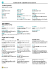

# <a name="work-with-includeprodshortincludesprodshortmd" />Utilizzare [!INCLUDE[prod_short](includes/prod_short.md)]

Durante l'esecuzione di task aziendali, si interagisce con i dati in diversi modi, ad esempio attraverso la creazione di record e l'immissione di dati, l'ordinamento e il filtraggio dei dati, la scrittura di note e l'output di dati ad altre applicazioni.

È possibile, ad esempio, rettificare le dimensioni e l'ubicazione di una pagina, espandere la larghezza di colonne e aumentare l'altezza delle intestazioni di colonna e modificare l'ordinamento dei dati nelle colonne. Se si desidera utilizzare la barra di scorrimento orizzontale per visualizzare tutte le colonne in una pagina di elenco o nelle righe documenti, è disponibile un blocca quadro verticale per evitare lo scorrimento di alcune colonne.

[!INCLUDE [about-ui-learn](includes/about-ui-learn.md)]

## <a name="a-namecheatsheetatips-and-tricks" />Suggerimenti e trucchi

> [!TIP]
> Per una versione stampabile della panoramica delle funzioni più utilizzate, vedere l'immagine seguente e scaricare il file PDF.
>
> 

## <a name="links-to-learn-more" />Collegamenti per ulteriori informazioni

Nella tabella seguente sono elencate alcune delle funzionalità generali con i collegamenti agli argomenti che le descrivono.

> [!NOTE]
> Oltre alle funzioni dell'interfaccia utente generali descritte in questa sezione, è possibile utilizzare altre funzioni generali più correlate all'azienda. Per ulteriori informazioni, vedere [Funzionalità aziendali generali](ui-across-business-areas.md).

| A  | Vedere |
| --- | --- |
|Trovare una pagina, un report, un'azione, un argomento della Guida o un'estensione partner. |[Individuare pagine e informazioni con la funzionalità delle informazioni](ui-search.md) |
|Ottenere una panoramica delle pagine per il ruolo e per gli altri ruoli e accedere alle pagine.|[Ricerca di pagine con Esplora ruoli](ui-role-explorer.md)|
| Filtrare i dati in viste, report o funzioni utilizzando simboli e caratteri speciali. |[Ricerca, filtro e ordinamento di elenchi](ui-enter-criteria-filters.md) |
|Apprendere le molte funzioni generali che consentono di immettere dati in modo semplice e rapido.|[Immissione di dati](ui-enter-data.md)|
|Apprendere a come copiare e incollare dati rapidamente utilizzando i tasti di scelta rapida.|[Domande frequenti sulla funzionalità di copia e incolla](faq-copy-paste.yml)|
| Visualizzare o elaborare dati in specifici intervalli di date. |[Utilizzare date e orari del calendario](ui-enter-date-ranges.md) |
| Vedere quali campi devono essere compilati. |[Rilevare campi obbligatori](ui-mandatory-fields.md) |
|Comprendere il modo in cui le impostazioni locali del computer influiscono sull'interfaccia utente e sul sito della Guida e come modificare la lingua.|[Modifica di lingua e impostazioni locali](about-locale-language.md)|
|Apprendere a come interagire con Excel da qualsiasi elemento di [!INCLUDE[prod_short](includes/prod_short.md)]|[Visualizzazione e modifica in Excel](across-work-with-excel.md)|
|Allegare file, aggiungere collegamenti o scrivere note su schede e documenti.|[Gestire allegati, collegamenti e note in schede e documenti](ui-how-add-link-to-record.md)|
| Modificare le impostazioni di base come la società, la data di lavoro e la Gestione ruolo utente. |[Modificare le impostazioni di base](ui-change-basic-settings.md) |
|Ricevere notifiche su determinati eventi o modifiche dello stato, ad esempio quando si sta per fatturare un cliente con un saldo scaduto.|[Gestire le notifiche](ui-smart-notifications.md)|
| Modificare quali elementi dell'interfaccia utente vengono modificati e dove in base alle proprie preferenze.|[Personalizzare l'area di lavoro](ui-personalization-user.md) |
|Definire, visualizzare in anteprima, stampare ed eseguire processi batch.|[Utilizzare report, processi batch e XMLport](ui-work-report.md)|
| Gestire il contenuto e il formato di report e documenti, compresi quali campi di dati di un set di dati vengono visualizzati nel report e come siano disposti, lo stile del testo, le immagini e altro.|[Gestione dei layout di report e documento](ui-manage-report-layouts.md) |
|Ottenere informazioni sulle funzionalità che facilitano l'utilizzo di [!INCLUDE[prod_short](includes/prod_short.md)] da parte di persone disabili.|[Accessibilità e tasti di scelta rapida](ui-accessibility.md)|

## <a name="getting-around-in-business-central" />Esplorazione di Business Central
Di seguito un breve video su come esplorare [!INCLUDE[prod_short](includes/prod_short.md)].

> [!VIDEO https://www.youtube.com/embed/zqz03iMihx0]

## <a name="choosing-a-desktop-browser" />Scelta di un browser desktop

[!INCLUDE[prod_short](includes/prod_short.md)] supporta più browser che offrono ciascuno una varietà di funzionalità e capacità. Il browser svolge un ruolo importante nella reattività e fluidità dell'interfaccia utente. Consulta l'elenco dei browser supportati e consigliati per [Business Central Online](./product-requirements.md) e browser per [Business Central locale](/dynamics365/business-central/dev-itpro/deployment/system-requirement-business-central-v15).

- Laddove possibile, evita browser meno recenti come Internet Explorer e passa a uno dei nostri browser moderni consigliati, come il [nuovo Microsoft Edge](https://www.microsoft.com/edge/).  

    Internet Explorer non è più supportato. Per ulteriori informazioni, vedere [Documentazione di Microsoft Edge](https://support.microsoft.com/hub/4337664/microsoft-edge-help).
- Mantieni il tuo browser sempre aggiornato all'ultima versione.

## <a name="action-bars" />Barre delle azioni

In [!INCLUDE [prod_short](includes/prod_short.md)], svolgi la maggior parte del tuo lavoro in un elenco, in un documento o in una scheda. Tutti e tre i tipi di pagine hanno una barra con azioni rilevanti per la pagina particolare e le azioni sono quasi le stesse per la singola scheda o documento e per l'elenco delle entità. In questo modo è possibile gestire un singolo ordine di vendita nella pagina **Ordine di vendita** e nell'elenco **Ordini di vendita**, inclusa la pubblicazione e la fatturazione.  

Ma le azioni possono anche avere un aspetto diverso, o addirittura non essere presenti, a seconda di come apri la pagina. In particolare per le pagine elenco, la pagina elenco che apri dalla home page e la pagina che viene visualizzata quando la cerchi utilizzando l'icona a forma di  non sono identiche.  

Quando cerchi una pagina di elenco aperta, come l'elenco **Ordini di vendita**, è in modalità di visualizzazione. Le azioni per la modifica, la visualizzazione o l'eliminazione di una singola entità, come un ordine di vendita, vengono mostrate quando scegli l'azione **Gestisci**.  

> [!TIP]
> Se sai che utilizzerai spesso le azioni su questo secondo livello della barra delle azioni, scegli l'icona :::image type="icon" source="media/pin.png" border="false"::: per aggiungere la barra delle azioni e rendere immediatamente individuabili le azioni sotto i vari menu.
>
> Per nascondere di nuovo il secondo livello della barra delle azioni, scegli l'icona :::image type="icon" source="media/unpin.png" border="false":::.

Ma quando apri la stessa pagina dell'elenco dalla tua home page, l'azione **Gestisci** non è presente. Invece, per aprire un singolo ordine di vendita, è sufficiente scegliere il campo **Numero**. In questa visualizzazione non puoi aggiungere la barra delle azioni.  

## <a name="see-related-microsoft-trainingtrainingpathswork-pro-data-dynamics--business-central" />Vedi il relativo [training Microsoft](/training/paths/work-pro-data-dynamics-365-business-central/)

## <a name="see-also" />Vedi anche

[Prepararsi a fare affari](ui-get-ready-business.md)  
[Impostazione di Business Central](setup.md)  
[Funzionalità aziendali generali](ui-across-business-areas.md)  
[Suggerimenti sulle prestazioni per utenti aziendali](/dynamics365/business-central/dev-itpro/performance/performance-users?toc=/dynamics365/business-central/toc.json)

## <a name="includeprodshortincludesfreetrialmdmd" />[!INCLUDE[prod_short](includes/free_trial_md.md)]

[!INCLUDE[footer-include](includes/footer-banner.md)]
